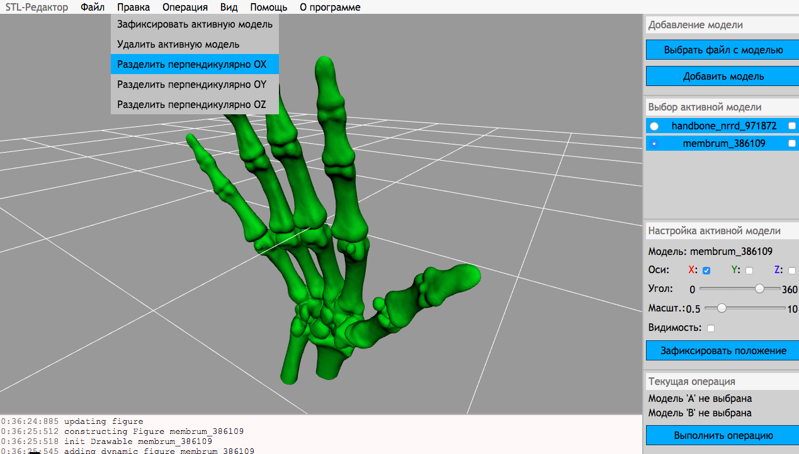
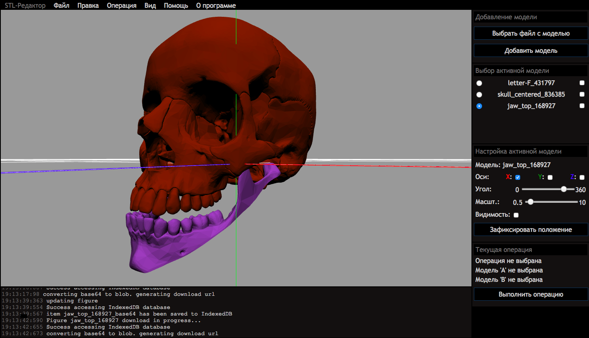

# STL-Editor



### Dark mode



## Server-side (Rocket backend, GoProxy, Nginx)

Build and run with Docker compose:
```
docker-compose up
```


## Client-side (WebGL client)

Requirements:
- GL-matrix lib should be [downloaded](http://glmatrix.net/), compiled and placed at `/webclient/js/lib/gl-matrix.js`
- Axios should be [downloaded](https://github.com/axios/axios) and placed at `/webclient/js/lib/axios.min.js`

In order to adjust style use SASS-preprocessor from [this link](http://sass-lang.com/install).
Add to PATH: `export PATH=$PATH:/path/to/dart-sass`. Usage: `sass style.scss style.css`.
Or it can be downloader with brew: `brew install --devel sass/sass/sass`


### Notes
- Back to stable version of Rust: `rustup default stable`
- Lib `gmp` can be omitted on Mac: `brew install gmp`
- Allow Chrome open local files on OSX
    ```
    open /Applications/Google\ Chrome.app --args --allow-file-access-from-files --disable-web-security --user-data-dir
    ```
- Brew may require proxy. On Unix it can be set with the following command: `export ALL_PROXY=https://host:port`
- Proxy for git (cargo/docker): `git config --global http.proxy http://host:port`
- Docker could require https while pulling image. 
  So prior to building image add the following to docker deamon config (dockerd).
  Docker config on macOS: tray -> preferences -> daemon -> advanced
  
  ```
  {
    ... other options
    "insecure-registries" : [
      "registry-1.docker.io:443"
    ]
  }
  ```


### Todo
- переиспользовать шейдеры и программу как предложено [здесь](https://webglfundamentals.org/webgl/lessons/webgl-drawing-multiple-things.html)

- сделать скрипт для скачивания gl-matrix/Logger/axios, выполнения npm install и перемещения в /js/lib

- добавить в панель меню статистику о фигуре кол-во врешин, граней, объем и т.д.
